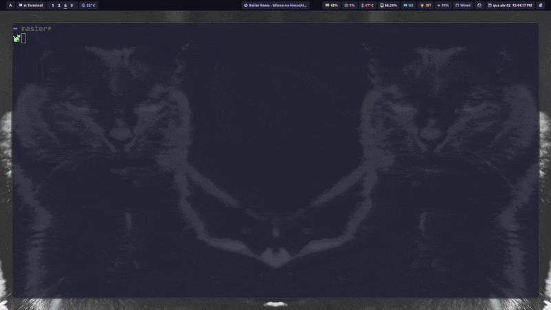

# 🥶📝 cold-note: a fast note-creating CLI tool

`cold-note` is a lightweight and customizable command-line tool designed to streamline note creation and organization for Obsidian users. With built-in templating, metadata handling, and Neovim integration, it helps you create structured notes efficiently.



---

## ✨ Features

🚀 Quick Note Creation – Stylish and functional interface powered by [charmbracelet/huh](https://github.com/charmbracelet/huh).

📁 Smart Directory Management – Automatically selects organized vault directories.

📜 Dynamic Templates – Supports multiple markdown templates with variables.

📝 Metadata Automation – Generates YAML frontmatter with tags, aliases, and timestamps.

💻 Seamless Editor Integration – Opens notes in Neovim Zen Mode for focused writing.

⚡ Environment-Based Configuration – Uses OBSIDIAN_VAULTO, OBSIDIAN_TEMPLATES and COLD_NOTE_EDITOR for flexibility.

---

## 🛠 Requirements

- Go 1.21+
- Neovim
- Obsidian
- Properly set environment variables (OBSIDIAN_VAULT, OBSIDIAN_TEMPLATES and COLD_NOTE_EDITOR)

---

## Installation

To use this program your need to first clone [this repository](https://github.com/peruzzoarthur/cold-note).

```bash
git clone https://github.com/peruzzoarthur/cold-note.git
```

Then change into the cloned project, run build and move the binary file to your binaries path.

```bash
cd cold-note
go build -o note cmd/note/main.go
sudo mv note /usr/local/bin/
```

In order to find the Obsidian vault and be able to import the templates for the .md files, declare the environment variables inside your shell config file.

```bash
echo 'export OBSIDIAN_VAULT="/home/user/vault/path"' >> ~/.zshrc
echo 'export OBSIDIAN_TEMPLATES="/home/user/templates/path"' >> ~/.zshrc
echo 'export COLD_NOTE_EDITOR="nvim-zen"' # or "nvim" or "vscode"

# adjust filename to your shell config file (`.bashrc`)
```

> [!TIP]
> COLD_NOTE_EDITOR variable can be set to:
>  - `nvim-zen`: Neovim with ZenMode (default behavior)
>  - `nvim`: Standard Neovim without ZenMode
>  - `vscode`: Visual Studio Code


All done! `cold-note` is now installed and configured. It can be run using:

```bash
note
```

> [!WARNING]
> The module default configuration strictly focuses on directories starting with numbers (a common Obsidian organization pattern).
> In other words: 'the directories where you create your notes must start with a number'. e.g. '00-inbox', '1-projects'
